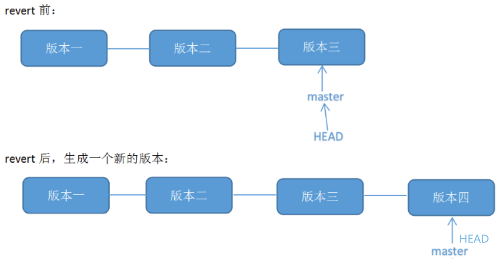

# git reset命令

```bash
git reset --soft 29f9bbd77da69902335cad77a12eac7b022b9f63
```


`git reset --soft` 命令是 Git 中的一个强大工具，它可以用于回退到某个特定的提交，同时保留文件的修改内容。这里是对该命令的详细解释：

## 命令结构

```bash
git reset --soft <commit-hash>
```

- `git reset` 是 Git 的一个基本命令，用于将当前的分支回退到指定的提交，并调整索引和工作目录中的内容。
- `--soft` 是 `git reset` 的一个选项，决定了在回退时如何处理文件的状态。`--soft` 会将 `HEAD` 移动到指定的 commit，但 **不会修改工作目录**  和 **索引** （也就是暂存区），因此你仍然可以看到文件的修改。

**各部分的解释：**

1. **`<commit-hash>`** ：

- `<commit-hash>` 是你想回退到的 commit 的哈希值。可以是一个完整的哈希（如 `29f9bbd77da69902335cad77a12eac7b022b9f63`）或者它的前几位字符（例如，`29f9bbd`）。`git log` 可以帮助你查找这个哈希值。

2. **`--soft` 选项** ：

- `--soft` 选项使得 Git **只移动 HEAD** ，即将当前分支指针（HEAD）回退到指定的 commit，但 **保留工作目录和暂存区的内容不变** 。换句话说，你的文件更改不会丢失，修改内容仍然会保留在暂存区。
- 如果你有一些修改没有提交，`git reset --soft` 会将这些修改**保留** ，并将它们放回暂存区，让你可以再次提交。

**具体的效果：**

1. **`HEAD` 会回退** ：这会将当前分支的 HEAD 指针（即当前正在工作的提交）指向指定的 commit。
2. **工作目录不变** ：你的工作目录中的文件不会被修改，意味着所有修改都会被保留，你的文件内容依然存在。
3. **暂存区不变** ：所有已暂存的文件也会被保留，意味着如果你之前用 `git add` 添加了修改，那么这些修改依然会保留在暂存区。

**举个例子：**

假设你有如下提交历史：

```sql
commit a1b2c3d - 最新的提交
commit 29f9bbd - 需要回退到的提交
commit d4e5f6g - 更早的提交
```

- 如果你执行 `git reset --soft 29f9bbd77da69902335cad77a12eac7b022b9f63`，这会发生以下变化：
  - **`HEAD`**  会指向 `29f9bbd` 提交，即回到你指定的提交。
  - **工作目录**  保持不变，你的文件内容依然会保留。
  - **暂存区**  也保持不变，你之前 `git add` 的修改仍然会保留。

这样，你就可以修改代码并重新提交，而不丢失之前的修改。

**常见的用法：**

- **撤销最近的提交并保留修改** ：假设你做了一个提交，但发现需要修改其中的内容，你可以使用 `git reset --soft HEAD^`（`HEAD^` 是指上一个提交）。这会撤销最近的提交，并保留你工作目录和暂存区的内容，允许你重新修改并提交。

**总结：**

- `git reset --soft <commit-hash>` 会将 `HEAD` 回退到指定的 commit，但 **保留文件内容和暂存区的修改** 。这适用于想要撤销某个提交，但又不希望丢失工作进度的情况。
- 使用此命令时，你可以修改或更新暂存区的文件，再次进行提交。

## `reset` [三种模式](https://x.zhixing.co/devops/the-differences-and-usages-of-3-modes-git-reset/)

分别是 `--soft`、`--mixed` 和 `--hard`，它们的作用和影响不同。下面是对每种模式的详细讲解：


1. **`git reset --soft <commit>`**

- **作用** ：将 `HEAD` 指针回退到指定的 commit，但 **不更改工作目录和暂存区** 。
- **效果** ：
  - `HEAD` 回退到指定的提交，即当前分支指针会指向指定的提交。
  - **工作目录（Working Directory）**  不变，文件的内容保留不变。
  - **暂存区（Staging Area）**  保持不变，之前已经暂存的文件仍然存在于暂存区。
- **使用场景** ：
  - 用于撤销最后一次提交并修改其中的内容，但保留文件更改和暂存区内容。适合你想重新提交修改内容时使用。
- **示例** ：

```bash
git reset --soft HEAD~1
```

这个命令将 HEAD 回退到上一个提交（`HEAD~1`），但是保留当前工作目录和暂存区中的修改。你可以编辑文件、重新暂存并提交。

2. **`git reset --mixed <commit>`**  （默认选项）

- **作用** ：将 `HEAD` 回退到指定的 commit，并且 **更新暂存区** （即撤销暂存），但 **不更改工作目录** 。
- **效果** ：
  - `HEAD` 回退到指定的提交。
  - **工作目录**  不变，文件内容保留不变。
  - **暂存区（Staging Area）**  被更新为与指定 commit 的内容一致。也就是说，撤销所有已经 `git add` 的文件，将它们从暂存区中移除，但文件内容仍然保持在工作目录中。
- **使用场景** ：
  - 用于撤销提交并取消暂存文件，但你仍然想保留文件修改。适用于需要修改代码但不想保留当前暂存区修改的场景。
- **示例** ：

```bash
git reset --mixed HEAD~1
```

这个命令将 HEAD 回退到上一个提交，并且从暂存区移除修改，但文件内容仍然保留。相当于撤销最近的 `git add` 操作。

3. **`git reset --hard <commit>`**

- **作用** ：将 `HEAD`、**暂存区**  和 **工作目录**  都回退到指定的 commit。
- **效果** ：
  - `HEAD` 回退到指定的提交。
  - **工作目录**  会被重置为指定 commit 的内容，所有未提交的修改（无论是暂存区的还是工作目录的）都会被丢弃。
  - **暂存区**  也会被重置，撤销所有已暂存的文件。
- **使用场景** ：
  - 用于彻底放弃当前的修改，回到某个提交状态。适用于你想完全撤销修改并且不保留任何更改时使用。
- **示例** ：

```bash
git reset --hard HEAD~1
```

这个命令会将 HEAD 回退到上一个提交，并且**彻底丢弃** 工作目录和暂存区中的所有修改。**注意** ：此操作无法恢复，慎重使用！


## **总结**

| 选项 | HEAD | 工作目录 | 暂存区 | 应用场景 | 
| --- | --- | --- | --- | --- | 
| soft | 回退到指定 commit | 保持不变 | 保持不变 | 用于撤销提交并重新提交，保留修改和暂存区内容 | 
| mixed | 回退到指定 commit | 保持不变 | 更新为指定 commit 内容 | 用于撤销提交并取消暂存，保留工作目录的内容 | 
| hard | 回退到指定 commit | 重置为指定 commit 内容 | 重置为指定 commit 内容 | 用于彻底丢弃修改，回到某个 commit 状态 |

|  |  |  |
|-----------------------------------------|-----------------------------------------|-----------------------------------------|


**适用场景举例：**

- **`--soft`** ：你想撤销最近的提交，但不丢失文件修改，准备重新提交。
- **`--mixed`** ：你想撤销提交并取消暂存，但仍然保留修改，进行后续编辑。
- **`--hard`** ：你想丢弃所有本地的修改并回到某个提交的状态，彻底放弃当前修改。

`每个选项的影响不同，选择时需要根据实际需求来决定。`

**git reset** 会改变提交历史，建议不要在公共分支使用，如果在公共分支撤销提交可以使用 **git revert** ，它会保留记录。在前端开发中，如果修改只存在于本地，并且你确定不需要这些修改，可以使用 git reset 来快速清理。但如果修改已经推送到远程分支，或者你只是想撤销某个特定的提交，为了避免影响团队协作和代码历史的完整性，强烈建议使用 git revert。 尤其是在多人协作的项目中，revert 更安全可靠。

**hard** 模式不仅会丢失已提交的改动，还可能丢失本地未提交的改动，要慎重使用。


# git revert

git revert是用于“反做”某一个版本，以达到撤销该版本的修改的目的。比如，我们commit了三个版本（版本一、版本二、 版本三），突然发现版本二不行（如：有bug），想要撤销版本二，但又不想影响撤销版本三的提交，就可以用 git revert 命令来反做版本二，生成新的版本四，这个版本四里会保留版本三的东西，但撤销了版本二的东西(test2)


# revert vs reset
|特性	    |git reset	|git revert|
| --- | --- | --- |
|修改历史	|会修改分支历史	       |不会修改分支历史，而是创建一个新的提交|
|应用场景	|本地开发，未推送的修改|已经推送的提交|
|安全性	  |相对低，可能会丢失提交|相对高，保留完整的提交历史|
|精确度	  |可以回退到任意提交	   |可以精确撤销某个提交的更改|
|应用场景|1.本地开发，还未推送: 当你提交了一些错误的更改，或者想放弃一些本地的修改，可以使用 reset 来撤销这些更改。2.修改提交历史: 例如，合并多个提交为一个，或者修改某个提交的message。3.放弃合并: 如果你在合并分支时遇到冲突，并且决定放弃合并，可以使用 reset 回到合并前的状态。|1.已经推送的提交: 当你需要撤销一个已经推送到远程仓库的提交时，应该使用 revert，因为它不会修改已有的提交历史，避免了团队协作中的混乱。2.只想撤销某个特定提交: revert 可以精确地撤销某个提交的更改，而不会影响其他提交。|

推荐：

[Git merge & rebase 区别和用法](https://x.zhixing.co/devops/the-differences-and-usages-of-git-merge-rebase/)

