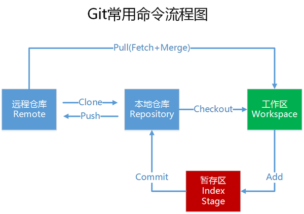

流程图
---

git文件的三种状态
---
已修改(modified)
已经修改了工作区的某些文件。

已暂存(staged)
已经执行了add操作，但还没有提交，只是暂存在提交清单里。

已提交(commited)
已经提交到本地仓库里，但还没push到远端仓库。

[参考资料](https://cycle263.github.io/blogs/team/git/advanced.html)