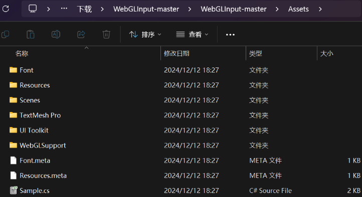

1. 去这个网站下载工程：
   
   [https://github.com/kou-yeung/WebGLInput](https://github.com/kou-yeung/WebGLInput)

2. 将下载工程中的WebGLSupport文件夹拷贝到自己的工程中
   
   

3. 将WebGLInput.cs组件添加到InputField组件挂载的对象上
4. 勾选show html element 不然输入后不显示。

