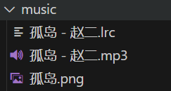

<div id="music-page">
</div>
<link rel="stylesheet" type="text/css" href="https://cdn.jsdelivr.net/npm/aplayer@1.10.1/dist/APlayer.min.css">
<script src="https://cdn.jsdelivr.net/npm/aplayer@1.10.1/dist/APlayer.min.js"></script>
<script src="https://cdn.jsdelivr.net/npm/meting@2.0.1/dist/Meting.min.js"></script>
<script>
    var userId = "509302810";
    var userServer = "netease";
    var userType = "playlist";
</script>
<script>
    const params = new URLSearchParams(window.location.search);
    var _param = {
         getCustomPlayList: function () {
            const musicPage = document.getElementById("music-page");
            const playlistType = params.get("type") || "playlist";
            if (params.get("id") && params.get("server")) {
                var id = params.get("id");
                var server = params.get("server");
                musicPage.innerHTML = `<meting-js listMaxHeight="600px"id="${id}"server="${server}"type="${playlistType}"mutex="true"preload="auto"order="random"autoplay="false"></meting-js>`;
            } else {
                musicPage.innerHTML = `<meting-js listMaxHeight="600px"id="${userId}"server="${userServer}"type="${userType}"mutex="true"preload="auto"order="random"autoplay=false></meting-js>`;
            }
        }
    };
    _param.getCustomPlayList();
    const vh = window.innerHeight * 1;
    document.documentElement.style.setProperty('--vh', `${vh}px`);
    window.addEventListener('resize', () => {
        let vh = window.innerHeight * 1;
        document.documentElement.style.setProperty('--vh', `${vh}px`);
    });
</script>

<div id="music-page2">
</div>
<link rel="stylesheet" type="text/css" href="https://cdn.jsdelivr.net/npm/aplayer@1.10.1/dist/APlayer.min.css">
<script src="https://cdn.jsdelivr.net/npm/aplayer@1.10.1/dist/APlayer.min.js"></script>
<script src="https://cdn.jsdelivr.net/npm/meting@2.0.1/dist/Meting.min.js"></script>
<script>
    var _param = {
         getCustomPlayList: function () {
            const musicPage = document.getElementById("music-page2");
            musicPage.innerHTML = `<meting-js 
                    id="509302810"
                    server="netease"
                    type="playlist"
                    autoplay=false
                    mutex="true"
                    preload="auto"
                    order="random"mini=false></meting-js>`;
        }
    };
   _param.getCustomPlayList();
</script>

<link rel="stylesheet" href="https://cdn.jsdelivr.net/npm/aplayer/dist/APlayer.min.css">
<div id="player"></div>
<script src="https://cdn.jsdelivr.net/npm/aplayer/dist/APlayer.min.js"></script>
<script>
  function ss () {
    const ap = new APlayer({
      container: document.getElementById('player'),
      audio: [
        {
          name: '萤火飞光',
          artist: '圈9',
          url: '/music/萤火飞光 - 圈9.mp3', // 音频文件路径
          cover: '/music/萤火飞光.png', // 封面图片路径
          lrc: '/music/萤火飞光 - 圈9.lrc' // 歌词文件路径
        }
      ],
      lrcType: 3 // 歌词模式，3 表示使用外部 LRC 文件
    });
  }
  ss();
  document.addEventListener('DOMContentLoaded', ss);
</script>

方法：

播放其他平台的音乐：

```html
<div id="music-page2">
</div>
<link rel="stylesheet" type="text/css" href="https://cdn.jsdelivr.net/npm/aplayer@1.10.1/dist/APlayer.min.css">
<script src="https://cdn.jsdelivr.net/npm/aplayer@1.10.1/dist/APlayer.min.js"></script>
<script src="https://cdn.jsdelivr.net/npm/meting@2.0.1/dist/Meting.min.js"></script>
<script>
    var _param = {
         getCustomPlayList: function () {
            const musicPage = document.getElementById("music-page2");
            musicPage.innerHTML = `<meting-js 
                    id="509302810"
                    server="netease"
                    type="playlist"
                    autoplay=false
                    mutex="true"
                    preload="auto"
                    order="random"mini=false></meting-js>`;
        }
    };
   _param.getCustomPlayList();
</script>
```

播放本地音乐：
播放单曲：

```html
<link rel="stylesheet" href="https://cdn.jsdelivr.net/npm/aplayer/dist/APlayer.min.css">
<div id="player"></div>
<script src="https://cdn.jsdelivr.net/npm/aplayer/dist/APlayer.min.js"></script>
<script>
  function ss () {
    const ap = new APlayer({
      container: document.getElementById('player'),
      audio: [
        {
          name: '萤火飞光',
          artist: '圈9',
          url: '/music/萤火飞光 - 圈9.mp3', // 音频文件路径
          cover: '/music/萤火飞光.png', // 封面图片路径
          lrc: '/music/萤火飞光 - 圈9.lrc' // 歌词文件路径
        }
      ],
      lrcType: 3 // 歌词模式，3 表示使用外部 LRC 文件
    });
  }
  ss();
  document.addEventListener('DOMContentLoaded', ss);
</script>
```

播放本地歌单：
_config.butterfly.yml

```yml
# Inject
# Insert the code to head (before '</head>' tag) and the bottom (before '</body>' tag)
# 插入代码到头部 </head> 之前 和 底部 </body> 之前
inject:
  head:
    - '<style type="text/css">#toggle-sidebar {bottom: 80px}</style>'
  bottom:
    - '<div id="music-player"></div>'
    - '<link rel="stylesheet" type="text/css" href="https://cdn.jsdelivr.net/npm/aplayer/dist/APlayer.min.css">'
    - '<script src="https://cdn.jsdelivr.net/npm/aplayer/dist/APlayer.min.js"></script>'
    - '<script>'
    - '  fetch("/music/playlist.json")'
    - '    .then(response => response.json())'
    - '    .then(data => {'
    - '      const ap = new APlayer({'
    - '        container: document.getElementById("music-player"),'
    - '        fixed: true,'
    - '        autoplay: false,'
    - '        audio: data,'
    - '        lrcType: 3'
    - '      });'
    - '    })'
    - '    .catch(error => console.error("Error loading playlist:", error));'
    - '</script>'
```

本地歌单生成方式：

资源存放路径：

``` js
const fs = require('fs');
const path = require('path');

// 音乐文件夹路径
const musicFolderPath = './source/music'; // 修改为你实际的音乐文件夹路径

// 获取音乐文件夹中的所有文件
fs.readdir(musicFolderPath, (err, files) => {
  if (err) {
    console.error('无法读取文件夹:', err);
    return;
  }

  // 筛选出所有音频文件
  const audioFiles = files.filter(file => {
    const ext = path.extname(file).toLowerCase();
    return ext === '.mp3'; // 支持 mp3 文件
  });

  // 创建歌单数组
  const playlist = audioFiles.map(file => {
    const pubilcMusicPath = '/music'; // pubilc
    // 使用正则表达式提取歌名和歌手
    const match = file.match(/^(.+?) - (.+?)\.(mp3)$/);
    if (match) {
      const songName = match[1]; // 歌名
      const artistName = match[2]; // 歌手名
      // 替换为正斜杠 '/'
      const fixPath = (filePath) => filePath.replace(/\\/g, '/');
      return {
        name: songName, // 歌曲名称（歌名）
        artist: artistName, // 歌手
        url: fixPath(path.join(pubilcMusicPath, file)), // 音乐文件的路径
        cover:  fixPath(path.join(pubilcMusicPath, `${songName}.png`)), // 封面使用歌名
        lrc:  fixPath(path.join(pubilcMusicPath, `${songName} - ${artistName}.lrc`)), // 歌词使用歌名
      };
    }
    // 如果文件名格式不符合预期，返回一个默认值
    return {
      name: file, // 歌曲名称为文件名
      artist: '未知艺术家', // 默认艺术家
      url: path.join(pubilcMusicPath, file), // 音乐文件的路径
      cover: 'default-cover.png', // 默认封面
      lrc: '', // 默认没有歌词
    };
  });

  // 将歌单数组保存为 JSON 文件
  const playlistJson = JSON.stringify(playlist, null, 2);
  fs.writeFileSync('./source/music/playlist.json', playlistJson, 'utf-8');
  console.log('歌单生成完毕！');
});

```
项目终端执行命令：
``` bash
node generatePlaylist.js
```
生成歌单文件playlist.json
``` json
[
  {
    "name": "Incarnation",
    "artist": "张靓颖",
    "url": "/music/Incarnation - 张靓颖.mp3",
    "cover": "/music/Incarnation.png",
    "lrc": "/music/Incarnation - 张靓颖.lrc"
  },
]
```


歌源：圈9
方法：F12,点击网络查看歌曲请求链接，跳转访问该链接就可以直接下载该音源。歌词也是一样的道理。

